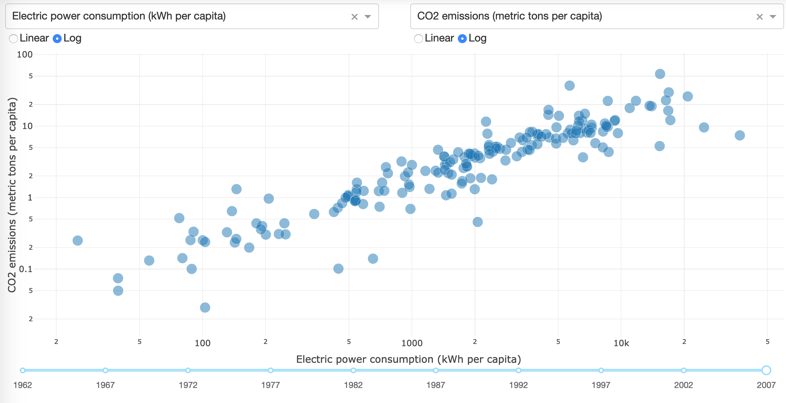

# Data Visualization with Dash

This example is from Plotly's [Dash tutorial](https://dash.plot.ly/getting-started-part-2).



## Deploy

```
rsconnect deploy dash . -n <SERVER-NICKNAME>
```

## Resources

[Posit Connect User Guide - Dash](https://docs.posit.co/connect/user/dash/)